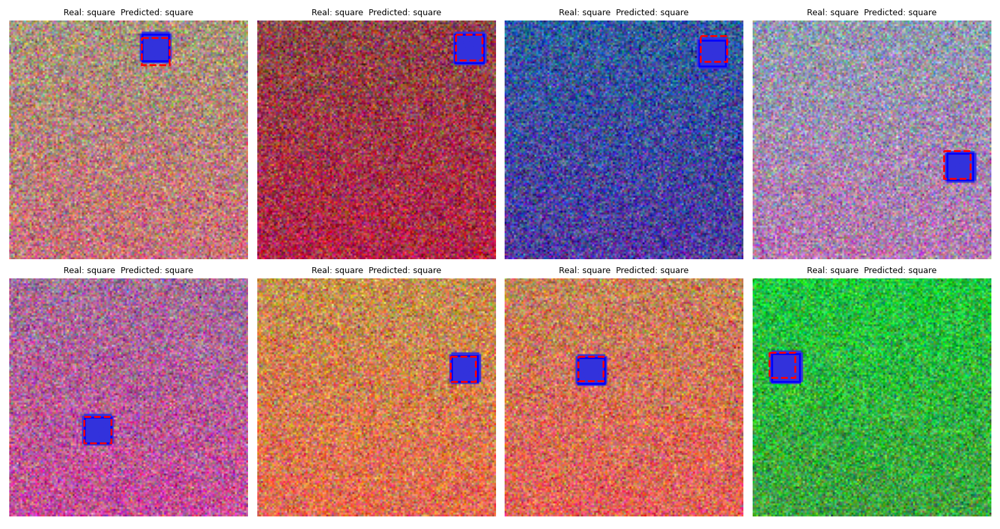
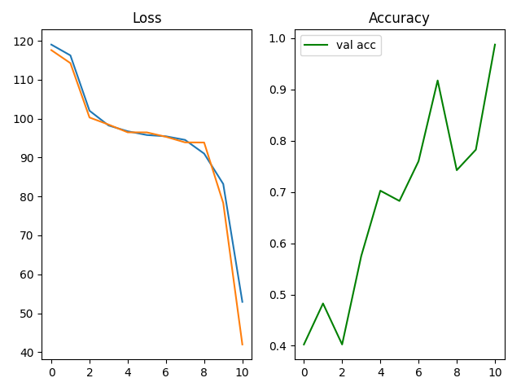
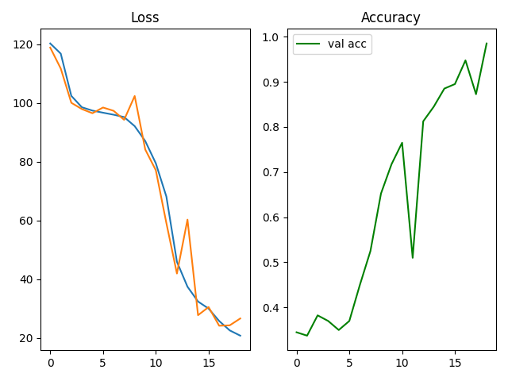
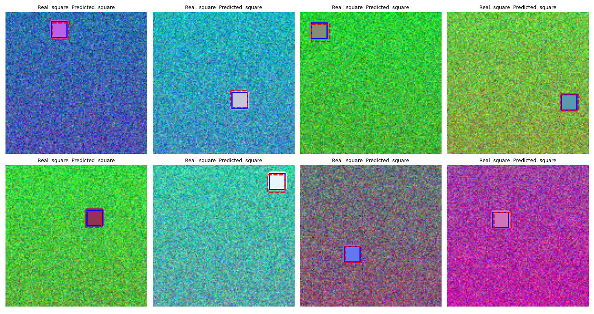
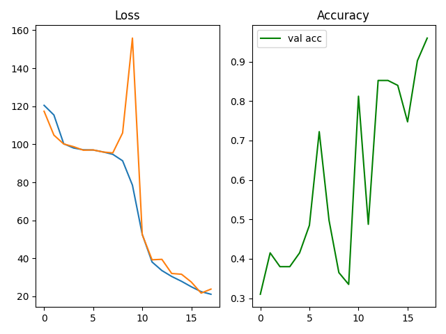
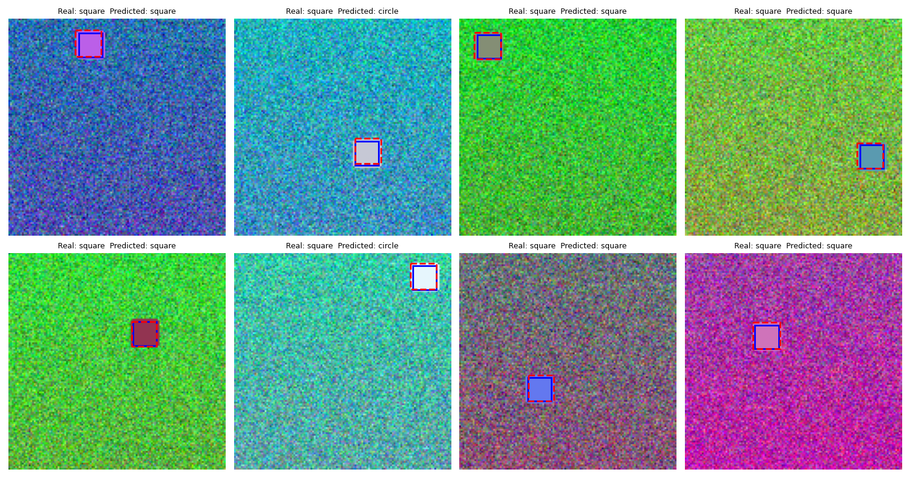

# Отчет по задаче Simple Object Detection

|Датасет|Эпохи|Accuracy (val)|Качество BBox|
|---|---|---|---|
|**shapes_dataset**|12|0.9525|Высокое|
|**shapes_dataset_bg**|11|0.9875|Высокое|
|**shapes_dataset_random**|19|0.9850|Высокое|

Первый датасет (shapes_dataset) — 12 эпох  

Второй датасет (shapes_dataset_bg) — 11 эпох  

Третий датасет (shapes_dataset_random) — 19 эпох

Разница в обучении вызвана усложнением данных: фоновый шум и случайное расположение фигур затрудняют классификацию и точное определение границ объекта. Однако архитектура с общим сверточным блоком и двумя отдельными головами для класса и bbox позволяет модели успешно находить фигуры на разных типах изображений.

Итог: модель устойчива к шуму. 